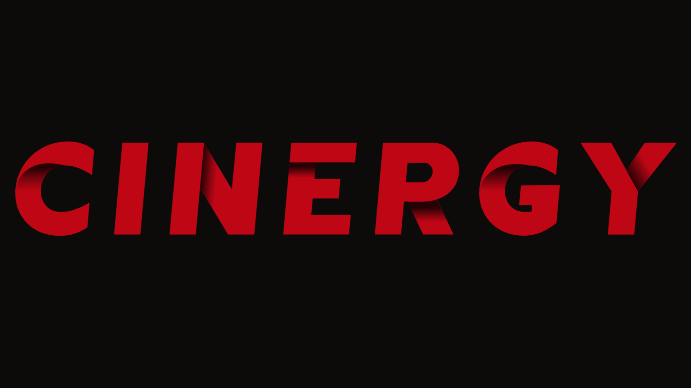

# CINERGY - 영화 추천 커뮤니티 서비스



## 📋 1. 프로젝트 개요
- **진행 기간**: 2024.11.18 ~ 2024.11.27
- **팀명**: CINERGY
- **목표**: 채팅 서비스 기반 영화 추천 서비스 구현

## 👥 2. 팀원 정보 및 업무 분담

## 팀 소개
CINERGY 팀은 프론트엔드/백엔드의 경계없이 크로스 펑셔널하게 협업하며, 각자의 전문성을 살려 프로젝트를 진행했습니다.

## 팀원 및 역할

| 이름 | 포지션 | 주요 기여 내역 | 
|------|---------|--------------|
| 박상호 | Extension & API Lead | • Chrome Extension 설계 및 개발<br>• 카카오 소셜 로그인 구현<br>• Youtube Data API 연동<br>• Netflix 데이터 수집/연동<br>• 외부 API 통합 및 최적화 |
| 최이화 | Full-Stack Lead | • 프론트엔드 UI/UX 설계/구현<br>• Vue.js 컴포넌트 개발<br>• Django REST API 설계/개발<br>• DB 모델링 및 쿼리 최적화<br>• TMDB API 연동 및 데이터 파이프라인 구축 |

## 협업 문화

### 개발 프로세스
- **애자일 방식**: 일간 스프린트로 빠른 피드백과 개선
- **페어 프로그래밍**: 핵심 기능 공동 개발로 코드 품질 향상
- **코드 리뷰**: Github를 통해 상시 코드 리뷰 진행

### 기술 공유
- **데일리 스크럼**: 매일 오전 진행 상황 및 이슈 공유
- **기술 세미나**: 새로운 기술 학습 내용 공유
- **문서화**: Notion을 활용한 기술 문서 작성

## 🎯 3. 목표 서비스 구현 및 실제 구현 정도

### 주요 기능 구현 현황
| 기능 | 목표 | 구현 내용 | 미구현 내용 | 진행률 |
|------|------|-----------|------------|---------|
| 영화 추천 | 채팅 기반 개인화 추천 | • 날짜 필터링<br>• 채팅 수 기반 필터링<br>• Netflix 연동 추천 | - | 100% |
| 실시간 채팅 | 컨텐츠 시청 동시 채팅 시스템 | • 실시간 채팅 구현<br>• 시청 시간 연동<br>• 채팅 기록 저장 | - | 100% |
| 커뮤니티 | 실시간 영화 리뷰 시스템 | • CRUD 구현<br>• 백엔드 실시간 댓글 | • 프론트엔드 실시간 댓글<br>• 실시간 채팅 출력 | 50% |
| 검색 기능 | Youtube 리뷰 검색 시스템 | • 제목 기반 리뷰 검색 | - | 100% |

### 외부 API 및 서비스 연동
#### 1. Chrome Extension
- **Netflix 데이터 연동**
  - 실시간 시청 기록 자동 수집 및 동기화
  - Netflix 콘텐츠 데이터 활용
- **실시간 채팅 서비스**
  - 영화 타임라인 기반 실시간 채팅
  - 시청 시간대별 채팅 기록 저장
  - 로그인에 따른 채팅 기능 제공
  - 채팅 내역 데이터베이스 관리

#### 2. 소셜/미디어 플랫폼 통합
- **카카오 소셜 로그인**
  - OAuth 2.0 프로토콜 기반 보안 인증
  - 카카오 계정 연동을 통한 원클릭 회원가입
  - 카카오 프로필 정보 자동 동기화
- **Youtube API**
  - 영화 리뷰 영상 검색 기능 제공

#### 3. TMDB API 활용
- **영화 데이터 관리**
  - 일일 박스오피스 정보 자동 업데이트
  - 영화 상세 정보 및 메타데이터 수집

- **핵심 기능**
  - 실시간 영화 정보 업데이트
  - 다국어 영화 정보 지원 (한글/영문)
  - 고화질 포스터 제공
  - 영화 트레일러 자동 연동

- **데이터 활용**
  - 장르 기반 추천 시스템 구축
  - 인기도 지수 계산에 활용
  - 장르별 필터링

## 📊 4. 데이터베이스 모델링 (ERD)
### 컴포넌트 구조

### ERD
.png)
.png)


## 🔍 5. 추천 알고리즘 설명
### 1. View 구현
```python
# couumnity/views.py
from django.db.models import Count
from django.utils import timezone
from datetime import timedelta

@api_view(['GET'])
def get_recommended_content(request):
    # 최근 7일간의 인기 콘텐츠
    recent_date = timezone.now() - timedelta(days=7)
    
    recommended = Chat.objects.filter(
        created_at__gte=recent_date
    ).values(
        'netflix_id',
        'title'
    ).annotate(
        chat_count=Count('id')
    ).order_by('-chat_count')[:5]
    
    return Response(recommended)
```
### 2. counter.js에 추천 기능 추가
```javascript
// src/stores/counter.js
const recommendedContents = ref([])

// 추천 콘텐츠 가져오기
const getRecommendedContent = async function() {
if (!token.value) {
    console.error("Token is missing")
    return
}

try {
    const response = await axios({
    method: 'get',
    url: `${API_URL}/community/api/recommended/`,
    headers: {
        Authorization: `Token ${token.value}`
    }
    })
    recommendedContents.value = response.data
} catch (error) {
    console.error('추천 콘텐츠 로드 실패:', error)
}
}
```

### 3. Vue 컴포넌트
```html
<template>
    <div class="recommended-container">
      <h2 class="section-title">이번 주 인기 콘텐츠</h2>
      
      <div class="content-list">
        <div v-for="(content, index) in store.recommendedContents" 
             :key="content.netflix_id" 
             class="content-item"
             @mouseover="hoveredIndex = index"
             @mouseleave="hoveredIndex = null">
          
          <!-- 순위 숫자 -->
          <div class="rank-wrapper">
            <span class="rank">{{ index + 1 }}</span>
          </div>
          
          <!-- 콘텐츠 정보 -->
          <div class="content-info">
            <div class="title-section">
              <h3 class="content-title">{{ content.title }}</h3>
              <div class="chat-count">
                <span class="count-value">실시간 인기도 {{ content.chat_count }}</span>
              </div>
            </div>
            
            <a :href="`https://www.netflix.com/watch/${content.netflix_id}`" 
               target="_blank"
               class="watch-button"
               :class="{ 'button-visible': hoveredIndex === index }">
              <span class="button-text">지금 시청하기</span>
            </a>
          </div>
        </div>
      </div>
    </div>
  </template>
  
  <script setup>
  import { ref, onMounted } from 'vue'
  import { useCounterStore } from '@/stores/counter'

  const hoveredIndex = ref(null)  
  
  const store = useCounterStore()
  const expandedIndex = ref(0)
  
  const toggleSize = (index) => {
    expandedIndex.value = expandedIndex.value === index ? null : index
  }
  
  onMounted(() => {
    store.getRecommendedContent()
  })
  </script>
```

## 🎯 6. 핵심 기능에 대한 설명

**Chrome Extension 채팅 시스템**
- 실시간 시청 시간 연동 채팅
- Netflix 콘텐츠 정보 자동 추출
- 사용자별 채팅 내역 저장 및 관리
- 시청 시간대별 채팅 타임라인 제공

**추천 시스템**
- 채팅 참여도 기반 인기 콘텐츠 추천
- 최근 7일간의 활성화된 채팅방 분석
- Netflix ID 기반 콘텐츠 매칭
- 실시간 인기도 측정 및 순위 산출

**커뮤니티 기능**
- 영화 리뷰 CRUD 기능
- Youtube 리뷰 영상 연동

**인증 시스템**
- 카카오 소셜 로그인 연동
- OAuth 2.0 기반 보안 인증
- 토큰 기반 사용자 인증
- 프로필 정보 자동 동기화

## 🤖 7. 생성형 AI 활용

**Perplexity, Chat GPT 활용**
- 개인화 설정
```text
# 설명

Django/Vue.js 기반 영화 커뮤니티 웹 서비스 및 크롬 확장 프로그램 개발 프로젝트
- 기술 스택: Python 3.9.x, Django 4.2.x, Vue 3, Node.js LTS
- 주요 기능: 시간대별 채팅, TMDB 기반 영화 추천, 실시간 커뮤니티
- 개발 목표: 사용자 친화적 UI/UX, 효율적 데이터 처리, 확장 가능한 아키텍처


# AI 프롬프트 
## AI 응답 지침

당신은 영화 커뮤니티 웹 서비스 개발을 위한 AI 어시스턴트입니다. 다음 지침에 따라 응답해주세요:

**응답 형식**
- 모든 응답은 한국어로 작성
- 전문 용어는 영문 병기 필수
- 응답은 항상 구조화된 형태로 제공
- 코드 예시는 반드시 언어 명시 및 주석 포함

**기술 범위**
- Django 4.2.x / Python 3.9.x
- Vue 3 / Node.js LTS
- TMDB API 통합
- 크롬 확장 프로그램 개발

**응답 우선순위**
1. 실현 가능성
2. 성능 최적화
3. 확장성
4. 유지보수 용이성

**코드 블록 형식**
# Python/Django 코드는 다음 형식으로 제공
def example():
    기능 설명
    Parameters:
    Returns:
    pass

// Vue/JS 코드는 다음 형식으로 제공
export default {
  // 컴포넌트 설명
  // 주요 기능 설명
}

**제외 사항**
- 지정된 기술 스택 외 제안
- 검증되지 않은 실험적 기술
- 모호한 설명이나 추상적 제안

**답변 구조**
1. 핵심 요약
2. 상세 설명
3. 구현 방안
4. 고려사항
5. 권장사항


**추천 시스템 고도화**
- 채팅 참여도 기반 가중치 부여
- 시간대별 인기도 분석
- 연관 콘텐츠 자동 추천
- 사용자 행동 패턴 학습
```

## 💭 8. 프로젝트 회고

**기술적 성과**
- Chrome Extension과 Django 백엔드 연동
- Vue.js 기반 실시간 데이터 처리
- 실시간 채팅 시스템 구현
- 데이터 기반 추천 시스템 개발

**향후 개선 계획**
- 채팅 데이터 분석 고도화
- 추천 알고리즘 변수 추가 및 정확도 개선
- UX/UI 최적화

**프로젝트 의의**
- 실제 서비스 가능한 웹 애플리케이션 구현
- 실제 운영 중인 Netflix에서 적용 가능한 서비스의 개발
- 프론트엔드/백엔드 통합 개발 경험
- 실시간 처리 시스템 아키텍처 설계
